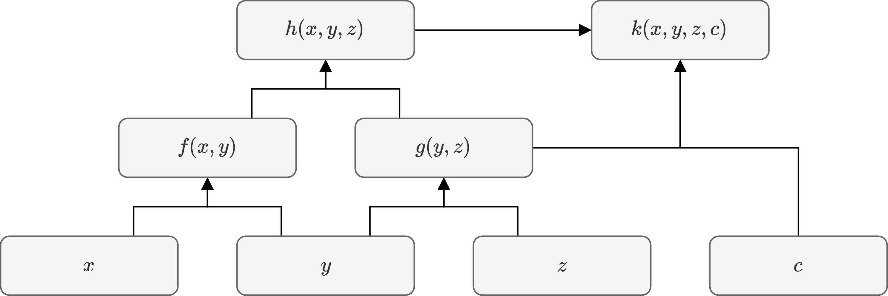

A `column` contains some data type `T` whose value changes for each entry.

The computation graph forms a tower of input and output columns with independent columns (e.g. read-in from the dataset) on the bottom and user-defined ones evaluated out of existing one above.

<figure markdown="span">
  
  <figcaption>Computation graph with 4 independent and dependent columns.</figcaption>
</figure>

It is processed top-down in accordance with the columns' laziness:
A column value is updated for an entry only if it is required as an input column.

The following properties of the computation graph are also guaranteed:

- No values are copied when used as inputs for dependent columns.
    - The value *is* copied if an implicit conversion is required.
- The value is never computed more than once per entry.